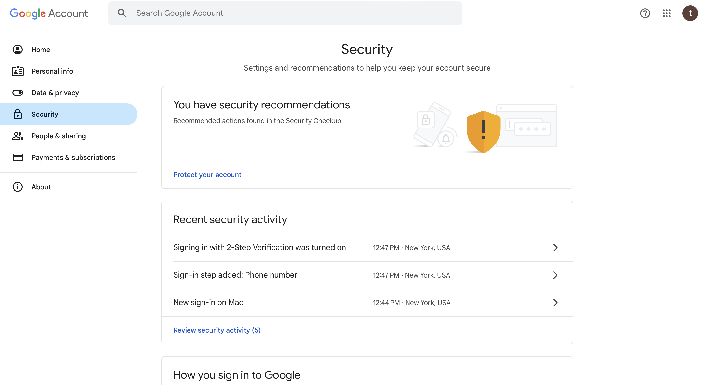
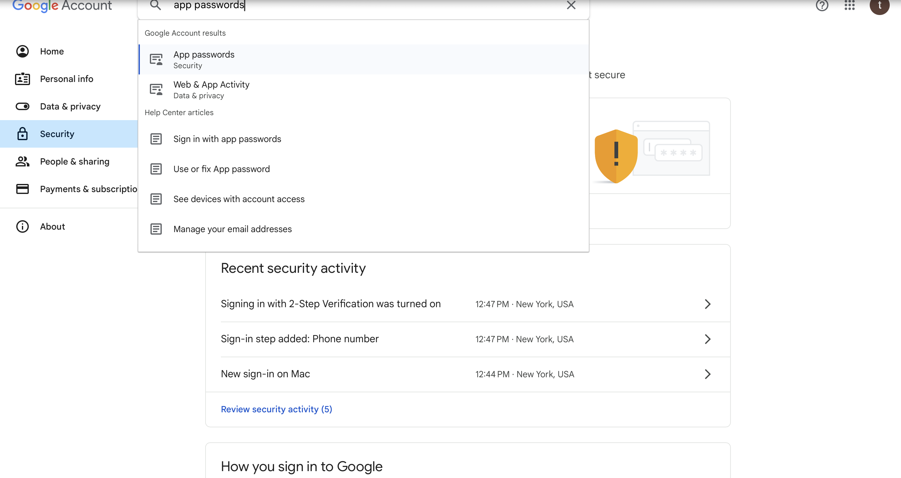

# ACM Automation Workshop 

## Overview

Welcome to the Automation Workshop! This workshop aims to equip participants with the skills to automate repetitive tasks using various tools and programming languages. 

## Table of Contents

- [Prerequisites](#prerequisites)
- [Workshop Structure](#workshop-structure)
- [Installation Guide](#installation-guide)
- [Google Email Setup](#google-email-setup)
- [Resources](#resources)
- [Contact Information](#contact-information)
- [License](#license)

## Prerequisites

Before attending the workshop, please ensure you have the following:

- Basic understanding of programming concepts.
- Familiarity with the command line/terminal.
- A laptop with internet access.

## Workshop Structure

The workshop will be conducted over and will include:

- **Presentations**: Overview of automation tools and techniques.
- **Hands-on Sessions**: Guided coding.
- **Q&A Sessions**: Opportunity to ask questions and clarify concepts.

## Installation Guide

To prepare for the workshop, please follow these steps:

1. **Install Python**:
   - [Download Python](https://www.python.org/downloads/) and follow the installation instructions for your operating system.

2. **Create a Virtual Environment**:
   Navigate to your project directory in the terminal and run:

   ```bash
   python -m venv venv

   ### On Windows:

    venv\Scripts\activate

   ### On macOS:

    source venv/bin/activate

3. **Activate Virutal Environment**:

    ```bash
    pip install -r requirements.txt

## Google Email Setup

In this automation workshop you will have to create a dummy email account to be able to test the automation. 

1. **Create a New Gmail Account**:
Create a google gmail account [Click Here](https://accounts.google.com/lifecycle/steps/signup/name?continue=https://www.google.com/?client%3Dsafari&ddm=0&dsh=S554583307:1729873778497504&ec=GAZAmgQ&flowEntry=SignUp&flowName=GlifWebSignIn&hl=en&ifkv=AcMMx-coRz2WMO2lGLzZ8DCKyZzMCrqBw50WPK6U9R8rwFpE1Ekg8LQACkF84KFNMcTYOga1UiWz&TL=AKOx4s3KdT78AzB17J0jXJhJenMCy7rqOC4ynTEkaOL9zR6L0IFh5IDk6tP5zCVV) 
**(IF there is issues just click next and it should refresh!)**
- Continue to fill out the information for the dummy account. 
2. **Two-Step Auth**:

<p align="center">
  
</p>

Once you have created an account you can go to [manage your google acount]

<p align="center">
  
</p>

- double check that 2 step auth is enabled!

<p align="center">
  
</p>

- If not enabled, click on verify two step auth and fill out the information.

3. **App Passwords**:

<p align="center">
  
</p>

Search App Passwords in the search bar in your google account. 
Click on the option and continue to the next steps!

<p align="center">
  
</p>

- Write any name for the app name (Ex. Automation) and click create!

<p align="center">
  
</p>

COPY THE GENERATED CODE BEFORE CLOSING THE WINDOW!!!!
- save the code somewhere you will keep safe!

---

## Resources
For any help in installing python and setup, please try these instructions! 
[Download Python](https://www.python.org/downloads/)
[Setup Python](https://docs.python.org/3/using/index.html)

## Contact Information

If you encounter any bugs or issues email: acm@manhattan.edu or [Click Here](mailto:acm@manhattan.edu)

Please provide as much detail as possible, including steps to reproduce the issue and we will try to help you out!

---

# License

MIT License

Copyright (c) [2024] [ACM]

Permission is hereby granted, free of charge, to any person obtaining a copy
of this software and associated documentation files (the "Software"), to deal
in the Software without restriction, including without limitation the rights
to use, copy, modify, merge, publish, distribute, sublicense, and/or sell
copies of the Software, and to permit persons to whom the Software is
furnished to do so, subject to the following conditions:

The above copyright notice and this permission notice shall be included in all
copies or substantial portions of the Software.

THE SOFTWARE IS PROVIDED "AS IS", WITHOUT WARRANTY OF ANY KIND, EXPRESS OR
IMPLIED, INCLUDING BUT NOT LIMITED TO THE WARRANTIES OF MERCHANTABILITY,
FITNESS FOR A PARTICULAR PURPOSE AND NONINFRINGEMENT. IN NO EVENT SHALL THE
AUTHORS OR COPYRIGHT HOLDERS BE LIABLE FOR ANY CLAIM, DAMAGES OR OTHER
LIABILITY, WHETHER IN AN ACTION OF CONTRACT, TORT OR OTHERWISE, ARISING FROM,
OUT OF OR IN CONNECTION WITH THE SOFTWARE OR THE USE OR OTHER DEALINGS IN THE
SOFTWARE.


